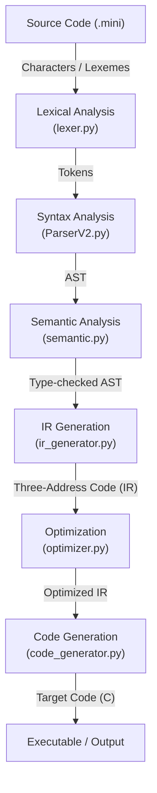

---

# <div align=center> Mini-C Compiler</div>

---
## Overview

**Mini-C Compiler** is a complete compiler implementation that translates a subset of C language into executable code. It demonstrates all major phases of compilation: lexical analysis, parsing, semantic analysis, intermediate representation, optimization, and code generation.

### Key Features

- Complete lexical analysis with error recovery
- Recursive descent parser with AST generation
- Semantic analysis with type checking
- Three-Address Code (TAC) intermediate representation
- Multi-level optimization (-O0, -O1, -O2)
- Target code generation (C code output)
- Comprehensive error reporting

---

## Architecture



---

## Installation & Usage

### Basic Usage

```bash
# Step 1: Compile with Mini-C Compiler
python compiler.py test.mini --target=c

# Step 2: Compile generated C code with GCC
gcc test.c -o test

# Step 3: Run the executable
./test
```

### Command Line Options

| Option | Description |
| --- | --- |
| `-O0` | No optimization |
| `-O1` | Basic optimization |
| `-O2` | Full optimization (default) |
| `--target=c` | Generate C code (default) |
| `--ast` | Show Abstract Syntax Tree |
| `--ir` | Show Intermediate Representation |
| `--all` | Show all compilation phases |

### Examples

```bash
# Compile with full optimization (default)
python compiler.py program.mini

# Compile with no optimization
python compiler.py program.mini -O0

# Show all phases
python compiler.py program.mini --all

# Generate C code
python compiler.py program.mini --target=c

#If you want output in on go, then enter
python python compiler.py program.mini --target=c --run
```

---

## Language Specification

### Data Types

| Type | Description | Size | Example |
| --- | --- | --- | --- |
| `int` | Integer | 4 bytes | `42`, `-10` |
| `float` | Floating point | 4 bytes | `3.14`, `-0.5` |
| `char` | Character | 1 byte | `'a'`, `'\\n'` |
| `void` | No value | - | Function return |

### Operators

**Arithmetic:** `+`, `-`, `*`, `/`, `%`

**Comparison:** `==`, `!=`, `<`, `>`, `<=`, `>=`

**Logical:** `&&`, `||`, `!`

**Assignment:** `=`, `+=`, `-=`, `*=`, `/=`

**Increment/Decrement:** `++`, `--`

### Control Structures

**If Statement:**

```c
if (condition) {
    // then block
} else {
    // else block (optional)
}
```

**While Loop:**

```c
while (condition) {
    // body
}
```

**For Loop:**

```c
for (init; condition; update) {
    // body
}
```

**Break/Continue:**

```c
while (1) {
    if (condition) break;
    if (other) continue;
}
```

### Functions

**Declaration:**

```c
return_type function_name(type param1, type param2) {
    // body
    return value;
}
```

**Standard Library:**

- `printf()` - Print formatted output
- `scanf()` - Read formatted input
- `malloc()` - Allocate memory
- `free()` - Free memory

---

## Module Reference

### lexer.py

**Purpose:** Tokenizes source code into a stream of tokens

**Classes:**

- `Token`: Represents a single token with type, lexeme, line, and column
- `Lexer`: Main tokenizer class

**Key Methods:**

```python
lexer = Lexer(filename)
lexer.tokenize()
tokens = lexer.get_tokens()
lexer.write_tokens_file()
lexer.write_symbol_table()
```

**Features:**

- Keyword recognition
- Operator tokenization
- String/character literal handling
- Comment stripping (// and /* */)
- Line and column tracking
- Error reporting

---

### ParserV2.py

**Purpose:** Parses tokens into an Abstract Syntax Tree (AST)

**Classes:**

- `ASTNode`: Base class for all AST nodes
- `Parser`: Recursive descent parser
- `SymbolTable`: Parser-level symbol table
- Various node classes: `Program`, `FunctionDeclaration`, `Block`, `VarDeclaration`, `Assignment`, etc.

**Key Methods:**

```python
parser = Parser(tokens)
ast = parser.parse()
print_ast(ast)
```

**Features:**

- Recursive descent parsing
- Error recovery with synchronization
- Symbol table for declarations
- Expression precedence handling
- Control flow validation (break/continue in loops)
- Function scope tracking

---

### semantic.py

**Purpose:** Performs semantic analysis and type checking

**Classes:**

- `SemanticAnalyzer`: Main semantic checker
- `SemanticSymbolTable`: Scoped symbol management
- `SemanticError`: Exception for semantic errors

**Key Methods:**

```python
analyzer = SemanticAnalyzer()
analyzer.analyze(ast)
```

**Checks Performed:**

- Variable declaration before use
- Type compatibility in operations
- Function signature validation
- Return type checking
- Scope management
- Implicit type conversion (int → float)

---

### ir_generator.py

**Purpose:** Generates Three-Address Code (TAC) intermediate representation

**Classes:**

- `IRInstruction`: Single IR instruction representation
- `IRGenerator`: AST to IR translator

**Key Methods:**

```python
ir_gen = IRGenerator()
instructions = ir_gen.generate(ast)
```

**Features:**

- Temporary variable generation
- Label generation for control flow
- String literal management
- Loop label tracking (break/continue)
- Function scope tracking
- Variable type tracking

**Generated Data:**

- `instructions`: List of IR instructions
- `string_literals`: Dictionary mapping labels to strings
- `var_types`: Dictionary mapping variable names to types

---

### optimizer.py

**Purpose:** Optimizes IR code to improve efficiency

**Classes:**

- `Optimizer`: IR optimization engine

**Key Methods:**

```python
optimizer = Optimizer(optimization_level=2)
optimized = optimizer.optimize(instructions)
optimizer.print_stats()  # Only shows if level > 0
```

**Optimization Techniques:**

**Level 0 (-O0):** No optimization

- IR passed through unchanged
- No statistics displayed

**Level 1 (-O1):** Basic optimization

- Constant folding (compile-time expression evaluation)
- Dead code elimination (unused temporary removal)
- Statistics displayed

**Level 2 (-O2):** Full optimization (default)

- All -O1 optimizations
- Strength reduction (expensive → cheap operations)
- Statistics displayed

**Important Note:** The optimizer only folds expressions where BOTH operands are literal constants, never when variables are involved. This prevents incorrect optimization of runtime-dependent comparisons.

---

### code_generator.py

**Purpose:** Generates target C code from optimized IR

**Classes:**

- `CodeGenerator`: Target code generator

**Key Methods:**

```python
gen = CodeGenerator(target='c')
code = gen.generate(ir, string_literals, var_types)
```

**Features:**

- C header generation
- Variable declaration grouping by type
- Temporary variable declaration
- String literal substitution
- Control flow preservation (goto-based)
- Type-preserving code generation

---

## Advanced Features

### Symbol Table Management

- **Hierarchical scoping**: Nested block support
- **Type tracking**: Records variable types
- **Function signatures**: Stores return types and parameters
- **Standard library**: Pre-loaded functions (printf, scanf, malloc, free)

### Control Flow

- **Break/continue**: Label stack tracking for correct jumps
- **Loop nesting**: Proper label management for nested loops
- **Structured jumps**: Goto-based control flow in IR

### Type System

- **Basic types**: int, float, char, void
- **Implicit conversion**: int → float allowed in assignments/arithmetic
- **Type inference**: Temporaries inherit types from operations
- **Function types**: Tracked as `function:<return_type>`

### Error Recovery

- **Synchronization points**: Semicolons, braces, keywords
- **Multiple errors**: Reports all errors found
- **Line tracking**: Precise error location reporting
- **Graceful degradation**: Continues parsing after errors

---

## Optimization Details

### Constant Folding Rules

**Only folds when BOTH operands are literal constants:**

```
✓ Folded:     t1 = 2 + 3        →  t1 = 5
✓ Folded:     t1 = 10 * 5       →  t1 = 50
✗ Not folded: t1 = x + 1        (x is variable)
✗ Not folded: t1 = y >= 11      (y is variable)
```

**Why this matters:**

- Prevents incorrect optimization of runtime-dependent expressions
- Preserves program semantics
- Comparison results depend on variable values at runtime

### Dead Code Elimination Rules

**Removes only unused temporaries:**

```
✓ Removed:    t1 = 5 (never used)
✗ Kept:       t2 = x + 1 (used in y = t2)
✗ Kept:       user variables (always kept)
```

### Strength Reduction Rules

**Replaces expensive operations:**

```
x * 0  →  0
x * 1  →  x
x * 2  →  x + x
x + 0  →  x
```

---

## File Extensions and Outputs

### Input Files

- `.mini` - Mini-C source code

### Output Files

- `.c` - Generated C code
- `tokens.txt` - Complete token listing
- `symbol_table.txt` - Symbol table dump
- `<filename>_ir.txt` - IR code (both unoptimized and optimized)

---

## Known Limitations

1. **No arrays**: Array declarations not supported
2. **No pointers**: Pointer operations not implemented (except in stdlib functions)
3. **Limited stdlib**: Only 4 standard functions (printf, scanf, malloc, free)
4. **No preprocessor**: No #include, #define support
5. **Single file**: No multi-file compilation
6. **No structs/unions**: Only basic types supported

---

## Future Enhancements

- Array support
- Pointer arithmetic
- Structure definitions
- Multi-file compilation
- More optimization passes
- Better error messages
- x86-64 assembly generation (currently only C)

---

## Appendix A: Grammar Reference

### Program Structure

```
program → declaration*

declaration → function_declaration
            | var_declaration

function_declaration → type IDENTIFIER '(' parameter_list ')' block

parameter_list → parameter (',' parameter)*
               | ε

parameter → type IDENTIFIER

var_declaration → type IDENTIFIER ('=' expression)? ';'
```

### Statements

```
statement → var_declaration
          | assignment
          | compound_assignment
          | if_statement
          | while_statement
          | for_statement
          | return_statement
          | break_statement
          | continue_statement
          | block
          | expression_statement

block → '{' statement* '}'

if_statement → 'if' '(' expression ')' statement ('else' statement)?

while_statement → 'while' '(' expression ')' statement

for_statement → 'for' '(' for_init? ';' expression? ';' for_update? ')' statement

return_statement → 'return' expression? ';'
```

### Expressions

```
expression → logical_or_expression

logical_or_expression → logical_and_expression ('||' logical_and_expression)*

logical_and_expression → equality_expression ('&&' equality_expression)*

equality_expression → relational_expression (('==' | '!=') relational_expression)*

relational_expression → additive_expression (('<' | '>' | '<=' | '>=') additive_expression)*

additive_expression → multiplicative_expression (('+' | '-') multiplicative_expression)*

multiplicative_expression → unary_expression (('*' | '/' | '%') unary_expression)*

unary_expression → '!' unary_expression
                 | primary_expression

primary_expression → INTEGER_LITERAL
                   | FLOAT_LITERAL
                   | STRING_LITERAL
                   | CHAR_LITERAL
                   | IDENTIFIER
                   | function_call
                   | '(' expression ')'

function_call → IDENTIFIER '(' argument_list ')'

argument_list → expression (',' expression)*
              | ε
```
---

**End of Documentation**

**Auther**: ALI RAZA

**Last Updated**: 22 Jan 2026
